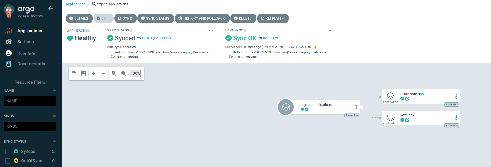
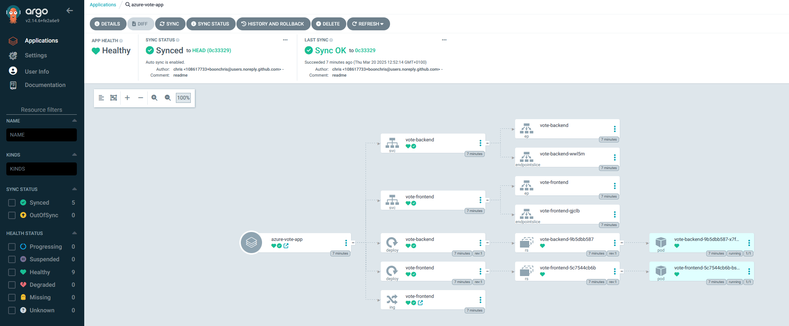
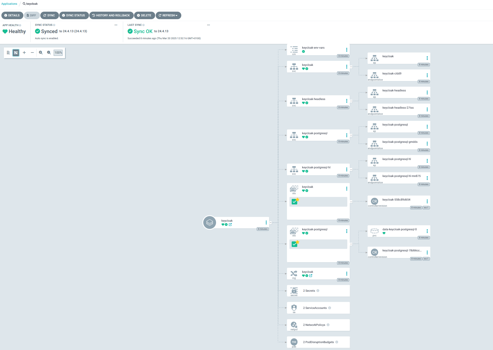

# Simple ArgoCD demo

This repo is used to demonstrate how to deploy a simple application using [ArgoCD](https://argo-cd.readthedocs.io/en/stable/).

## Our goal
The goal is to demonstrate the ease of use and power of ArgoCD. To achieve this, the repo contains an example of an [App Of Apps Pattern](https://argo-cd.readthedocs.io/en/latest/operator-manual/cluster-bootstrapping/). The parent application (defined in app-of-apps.yaml) configures ArgoCD to deploy any child applications that are defined in the ```argocd-applications``` directory.

## Prerequisites 

### Kubernetes cluster
This guide assumes you have a access to a (fresh) Kubernetes cluster. The steps in this demo can be applied on any type of Kubernetes Cluster.

#### minikube
If you want to create a local cluster (obviously not for production purposes), [Minikube](https://minikube.sigs.k8s.io/docs/) is a great option. I use this tool to run a local cluster on my Windows machine, using Podman in WSL2 to deploy the cluster (which runs in a container).

### Tools
Required CLI tools for this demo:
- [kubectl](https://kubernetes.io/docs/tasks/tools/install-kubectl-linux/)
- [argocd](https://argo-cd.readthedocs.io/en/stable/cli_installation/)

Both can be installed using brew
```bash
brew install kubernetes-cli
brew install argocd
```

## Deploying ArgoCD

Make sure your fresh cluster is ready and check if your kubeconfig is set up correctly by running
```bash
kubectl get pods -A
```

We are now going to create a namespace for ArgoCD and install ArgoCD in the new namespace.
```bash
kubectl create namespace argocd
kubectl apply -n argocd -f https://raw.githubusercontent.com/argoproj/argo-cd/stable/manifests/install.yaml
```

It might take a minute before ArgoCD has started. Check if all the pods have started by running
```bash
kubectl get pods -n argocd
```

ArgoCD auto-generates an initial password for the admin account. This password should be changed immediately in real-world clusters. Retrieve the password by running the command below and copy the result. 
```bash
argocd admin initial-password -n argocd
```

Check the service ports and port-forward the ArgoCD frontend to port 8080. This allows you to access the ArgoCD UI from your browser. 
```bash
kubectl get svc -n argocd
kubectl port-forward -n argocd svc/argocd-server 8080:443
```

Copy the forwarded address and open it in your browser. Skip the warning about the invalid certificate (we have not configured this) and advance to the ArgoCD UI. Enter username ```admin``` and the previously copied password. You will now be greeted with the (empty) User Interface.

Change the admin password User Info (Left-hand menu) > Update Password

It's now time to look at our parent application (app-of-apps.yaml). This file instructs ArgoCD to monitor the argocd-applications directory in this repository and deploys any applications defined within it. I have added comments in the yaml to explain what is configured. 

In your shell, navigate to the root of this repository and run.
```bash
kubectl apply -f https://raw.githubusercontent.com/boonchris/argocd-demo/main/app-of-apps.yaml
```

ArgoCD will now deploy all applications defined in the argocd-applications directory. This includes:
- The Azure Vote App (frontend and backend) based on the manifests in the azure-vote-app directory of this repository
- Keycloak and its components based on the Helm chart deployed in keycloak.yaml.

After deployment, the ArgoCD UI will show two applications: the parent and the child application. 


The app-of-apps (parent application) will look like this.


The child applications can be viewed individually as well. This shows a more detailed view, as it shows all kubernetes resources within the application.

By default, you will see a tree view with all the resources.

Tree view for the Azure Vote App:


The same view for our Keycloak deployment:


ArgoCD offers alternative views as well, for example the Network view:


## References

The following resources are very useful when learning about ArgoCD:
- [ArgoCD: Getting Started](https://argo-cd.readthedocs.io/en/stable/getting_started/#1-install-argo-cd)
- [What is GitOps, How GitOps works and Why it's so useful - TechWorld with Nana, 11:32](https://www.youtube.com/watch?v=f5EpcWp0THw)
- [ArgoCD Tutorial for Beginners | GitOps CD for Kubernetes - TechWorld with Nana, 47:52](https://www.youtube.com/watch?v=MeU5_k9ssrs)
- [Minikube Windows Installation](https://minikube.sigs.k8s.io/docs/start/?arch=%2Fwindows%2Fx86-64%2Fstable%2F.exe+download)
- [Podman Windows Installation](https://github.com/containers/podman/blob/main/docs/tutorials/podman-for-windows.md)

The initial excercise to deploy an application in k8s was forked from [FailFastFeast](https://github.com/jpvdham/FailFastFeast).